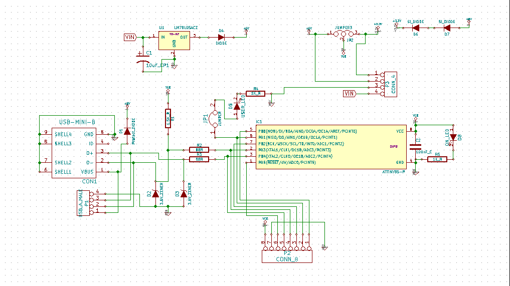

probUSBis Hardware
==================

Hardware files for probUSBis board.

This board is heavily inspired and based off of the [LittleWire](http://littlewire.cc/) and 
[DigiSpark](http://digistump.com/products/1) projects, with some little features of my own added to it.

The files are being made in KiCAD, but PDFs of the schematics will be made for releases.

Link to the [Hackaday Projects page](http://hackaday.io/project/3035) for this thing.

I have also made some code to run on this board in my [probUSBis_programs](https://github.com/emdarcher/probUSBis_programs) repository.

here is an image of the rev_a1 schamatic:

##WARNING!
* __rev_a1__ has a serious PCB error! The layout for the USB_A_MALE connector is flipped due to accidentally using a female layout. 
  - Solutions: 
    - if you still want a male USB plug on the board, you can solder it upside down, with pins sticking up into the bottom of the board.
    - Just don't use a male USB plug, and solder a suface mount female mini USB B jack on the top of the board in the designated location.  
